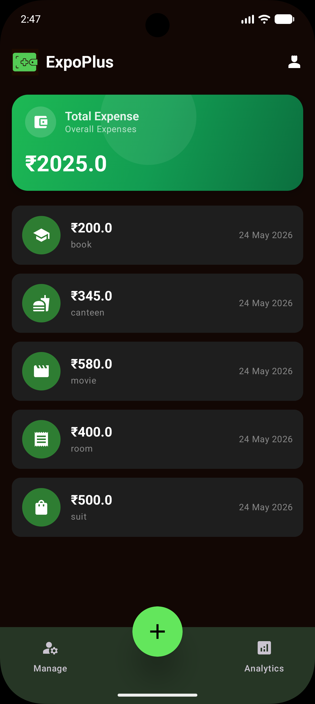
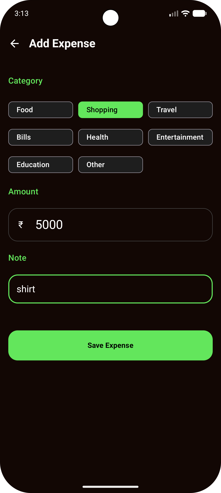
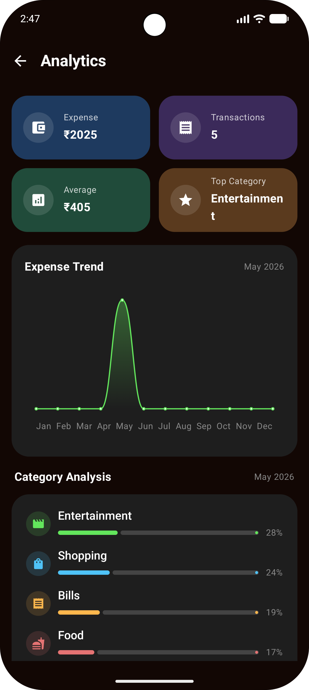
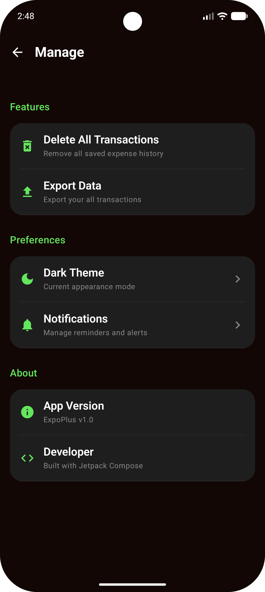

# 📊 ExpoPlus —  Expense Tracker

ExpoPlus is a modern Android Expense Tracking application built using **Kotlin** and **Jetpack Compose**, focused on combining:

- 📱 Android Development
- ☁️ Cloud Database Integration
- 📊 Data Analytics
- 🤖 AI-generated Insights
- 📈 Financial Visualization

into one intelligent finance management platform.

---

# ✨ Features

## 💰 Expense Management
- Add & manage expenses
- Category-based expense tracking
- Swipe to delete transactions
- Clean modern UI

## 📊 Analytics Dashboard
- Expense trend charts
- Category-wise analysis
- Spending summaries
- Monthly expense tracking

## 🤖 AI Insights
- Smart spending observations
- Highest spending category detection
- Average transaction analysis
- Financial behavior insights

## ☁️ Cloud Sync
- Supabase integration
- PostgreSQL backend support
- Online data synchronization

## 🎨 Modern UI
- Jetpack Compose UI
- Material 3 Design
- Dark premium theme
- Custom charts & dashboard cards

---

# 📸 Screenshots

> Add screenshots inside a `screenshots/` folder.

## Home Screen

```md

```

## Add Expense Screen

```md

```

## Analytics Dashboard

```md

```

## Manage Screen

```md

```

---

# 🏗️ Tech Stack

## Android
- Kotlin
- Jetpack Compose
- Material 3
- Navigation Compose
- ViewModel

## Database & Backend
- Room Database
- Supabase
- PostgreSQL

## Data Analytics
- Expense Trend Analysis
- Category Expense Analysis
- AI-generated Insights

## Visualization
- Custom Compose Charts
- Line Charts
- Progress Analytics

---

# 📊 Project Concept

ExpoPlus is designed as more than just an expense tracker.

The project combines:

- Android App Development
- Cloud Architecture
- Data Analytics
- Financial Visualization
- AI-assisted Analysis

to create an intelligent finance management system.

The app stores transactions locally and synchronizes them with a PostgreSQL database using Supabase. The collected financial data is analyzed to generate insights, spending trends, and category-based analytics.

---

# 🧠 AI Insights System

The analytics engine generates smart observations such as:

- Highest spending category
- Monthly spending patterns
- Expense growth trends
- Average spending behavior
- Financial summaries

### Example

> “Your highest spending this month was on Travel expenses. Spending increased compared to previous patterns.”

---

# ☁️ Architecture

```text
Android App
     ↓
Room Database
     ↓
Supabase API
     ↓
PostgreSQL Database
     ↓
Analytics & Visualization
```

---

# 📂 Project Structure

```text
ui/
 ├── screens/
 ├── components/
 ├── charts/
 └── theme/

data/
 ├── local/
 ├── remote/
 └── repository/

viewmodel/

utils/
```

---

# 🚀 Future Enhancements

- Budget Planning
- OCR Bill Scanner
- Voice Expense Entry
- Export Reports
- Recurring Expenses
- Notification Reminders
- Authentication System
- Advanced AI Insights
- Web Dashboard Integration

---

# 👨‍💻 Developed Using

- Android Studio
- Kotlin
- Jetpack Compose
- Supabase
- PostgreSQL

---

# ⭐ Purpose

This project was developed to explore the integration of:

- Android Engineering
- Data Analytics
- Cloud Databases
- Financial Technology
- AI-powered Insights
- Data Visualization

within a modern Android application.

---

# 📌 Author

**Tarun**

Android Developer | Full Stack Developer | Data Analytics & AI Applications
